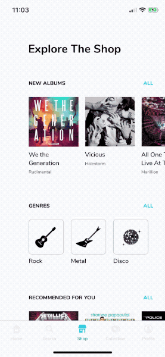

# VinylShop mobile app

Implementation of the [VinylShop mobile app](https://dribbble.com/shots/4996346-Vinyl-Shop-mobile-app) Dribbble shot by [@MatPrzegietka](https://dribbble.com/MatPrzegietka).

|Dribbble shot|Implementation|
|:-:|:-:|
|||

## Requirements

* Xcode 10.1
* Homebrew
* Python 3.7 (with [pipenv](https://github.com/pypa/pipenv) installed)

Run `./setup.sh` to initialize the environment.

## License

Copyright © 2019 [EL Passion](https://www.elpassion.com)

License: [GNU GPLv3](LICENSE)
